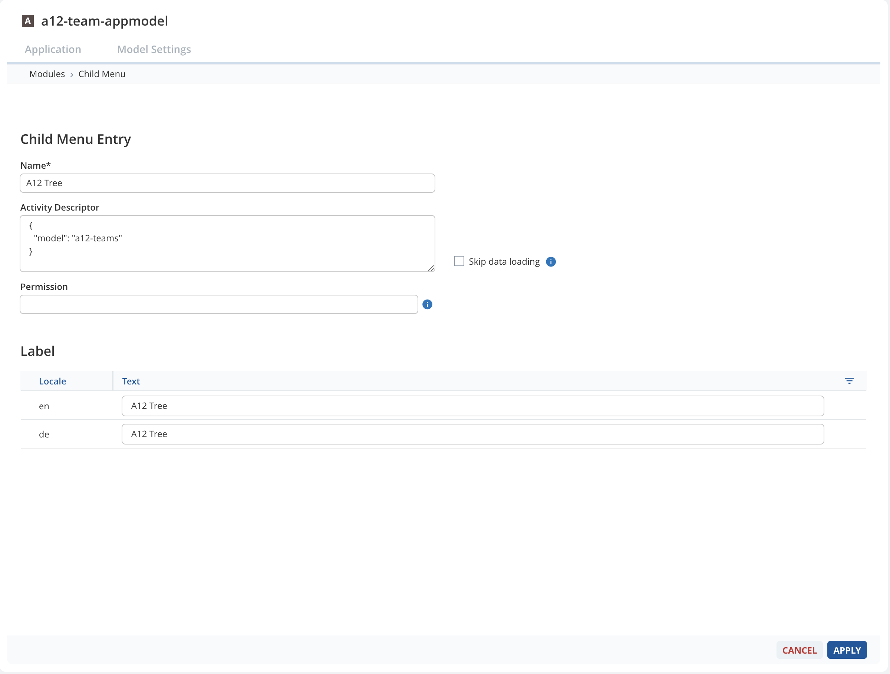
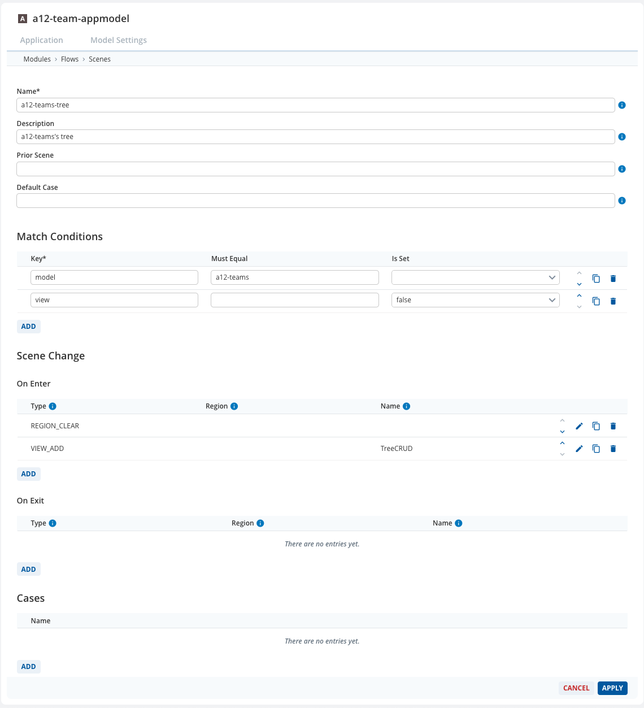
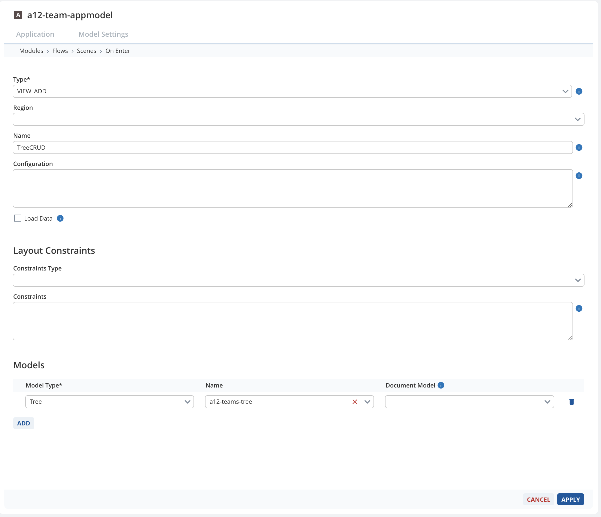
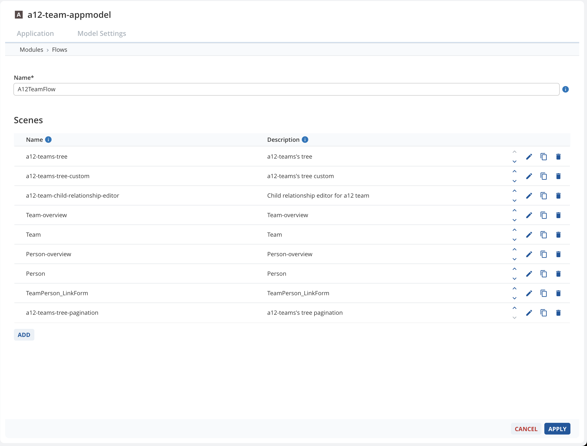
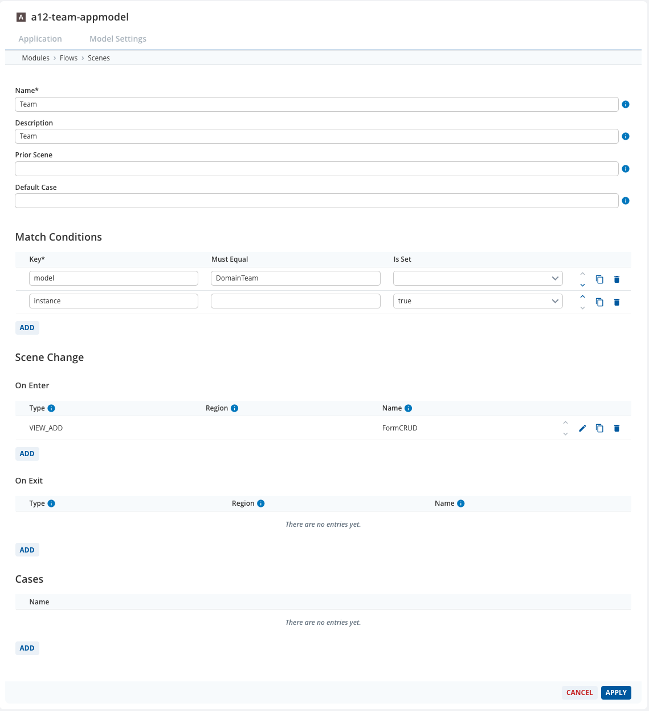
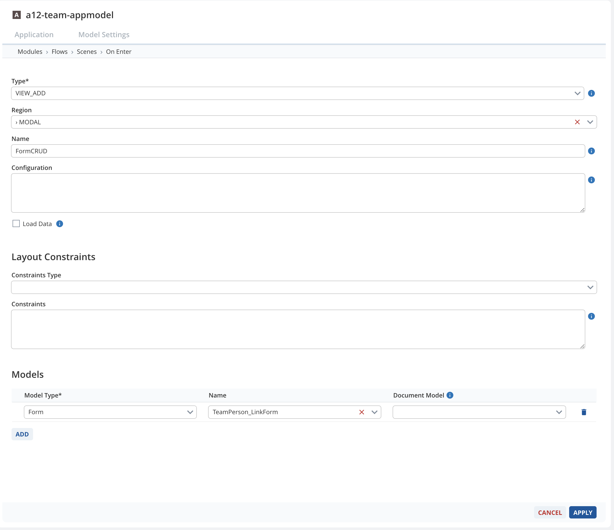

////
SPDX-License-Identifier: EUPL-1.2 OR LicenseRef-commercial
Copyright (c) 2012-2026 mgm technology partners GmbH
Dual License
This source file is part of the mgm A12 Platform and available under a choice of two different licenses:
1. Open-Source License - EUPL v1.2
You may redistribute and/or modify this file under the terms of the European Union Public License, version 1.2 - see https://eupl.eu/.
2. Commercial License
Alternatively, you may obtain a commercial license from mgm technology partners GmbH, that permits use of this software under different terms (including support and maintenance services).

Please contact a12-license@mgm-tp.com for more information.

You must select and comply with exactly one of the above license options.

Warranty Disclaimer (applies to either option)
THIS SOFTWARE IS PROVIDED "AS IS" AND WITHOUT WARRANTY OF ANY KIND, WHETHER EXPRESS OR IMPLIED, INCLUDING BUT NOT LIMITED TO THE WARRANTIES OF MERCHANTABILITY, FITNESS FOR A PARTICULAR PURPOSE AND NON-INFRINGEMENT, EXCEPT WHERE SUCH DISCLAIMERS ARE HELD TO BE LEGALLY INVALID. SEE THE RESPECTIVE LICENSE TEXT FOR DETAILS.
////
[#application-model]
=== Application Model

Please use link:/docs/SME/sme-am-ba-docs/index.html[SME Application Model] or link:/docs/CLIENT/client-documentation-bundle/index.html#/basics/application-model[Client]'s TypeScript interface to structure the Application Model.
The scope of this documentation only covers SME method.

==== Tree Engine Scene

Firstly, upload workspace to SME. In this section, it is assumed that the Application Model has been set up to work with a basic CRUD workflow (with Form Engine, Overview Engine and Relationship Engine).

Then open the module that needs to integrate Tree Engine and add a menu with this state configuration.

[image,options="nowrap",title="Tree Engine menu in Application Model"]

TIP: The key `model` is optional and does not have to exactly match the model name, it exists to make sure this menu is pointing to the correct scene which is configured in Application Model scenes.

Then go into the module flow and add a new Tree Engine scene, here is an example of how the scene looks like:

[image,options="nowrap",title="Tree Engine scene in Application Model"]

TIP: The `REGION_CLEAR` directive is optional.

CAUTION: The _Match Conditions_ section is very important.
The key `model` should match the one defined in menu.

On _Scene Change_ section, add a directive to `On Enter` event.

[image,options="nowrap",title="Tree Engine `VIEW_ADD` directive in Application Model"]

TIP: The `VIEW_ADD` should point to the registered Tree Engine container, which is `TreeCRUD` in this case.

CAUTION: The `Models` section is very important.
Tree Model name must be chosen from the selection box.
Please leave `Document Model` field empty.

The rest is configurable, it is possible to change and customize based on business requirements.
After that, save the Tree Engine scene.
The following figure is an example of a flow used in Tree Engine showcase application:

[image,options="nowrap",title="Tree Engine flow in Application Model"]

==== Connect to Other Engines

Tree Engine exposes a list of sagas via link:./assets/generated/typedoc/variables/extensions_client.TreeEngineFactories.createSagas.html[TreeEngineFactories.createSagas()]
which simplify connection process of the Tree Engine to other engines.

CAUTION: These sagas heavily depend on the _Match Conditions_ in the Application Model.
It is possible to strictly follow the guideline or <<#advanced/unregister-default-engine-sagas,unregister unnecessary ones>> during application setup then build a custom one.

===== Overview Engine

WARNING: We do not support Overview Engine because there has not been any use case whether Tree Engine should connect to Overview Engine.

===== Form Engine

In order to connect to the existing Form Engine scene, its _Match Conditions_ should be:

[image,options="nowrap",title="Form Engine scene in Application Model"]

TIP: The key `model` in the _Match Conditions_ section can be removed and defined inside the *Models* section of the `VIEW_ADD` directive (where Form Model mapping is done).

===== Relationship Engine

Relationship Engine has two types of display:

* Relationship Engine inside Form Engine
* Standalone Relationship Engine

Both types of Relationship Engine share the same configuration with a usual Form Engine. However, for the Standalone Relationship Engine, which will be opened via the "event_add_link", it will come with an extra descriptor which is "engine" => "relationship". This descriptor can be used in the match condition configuration to differentiate between 2 variants.

===== Editing Link Document

If the Relationship Model has a Link Document, it is required to add a scene to handle the Link Document.
The match condition configuration is the same as Form Engine but the model has to point to the Link Document Model instead of the Document Model.

Example of link Form Engine scene:

[image,options="nowrap",title="Link Form Engine scene in Application Model"]

TIP: To achieve the same behavior of editing Link Document as Relationship Engine, the scene should be rendered in `MODAL` region instead of `CONTENT` region.

Example of `VIEW_ADD` directive:

[image,options="nowrap",title="Link Form Engine `VIEW ADD` in Application Model"]
