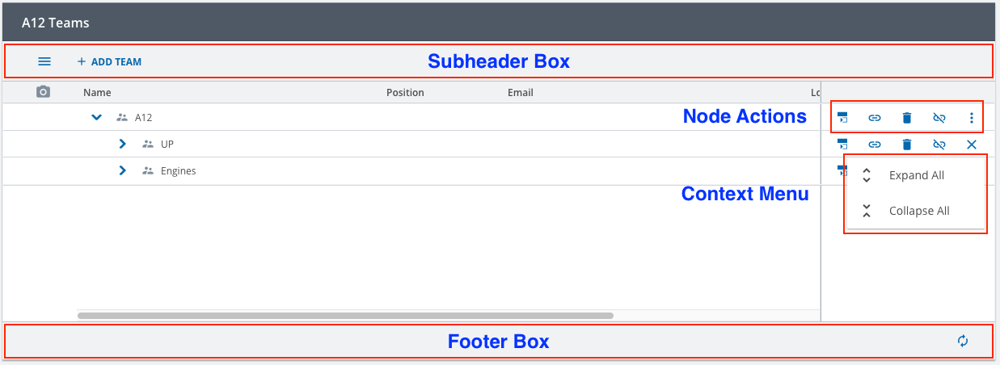
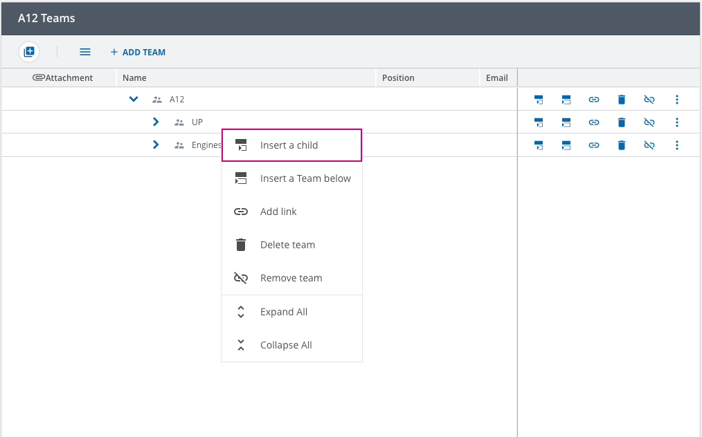

////
SPDX-License-Identifier: EUPL-1.2 OR LicenseRef-commercial
Copyright (c) 2012-2026 mgm technology partners GmbH
Dual License
This source file is part of the mgm A12 Platform and available under a choice of two different licenses:
1. Open-Source License - EUPL v1.2
You may redistribute and/or modify this file under the terms of the European Union Public License, version 1.2 - see https://eupl.eu/.
2. Commercial License
Alternatively, you may obtain a commercial license from mgm technology partners GmbH, that permits use of this software under different terms (including support and maintenance services).

Please contact a12-license@mgm-tp.com for more information.

You must select and comply with exactly one of the above license options.

Warranty Disclaimer (applies to either option)
THIS SOFTWARE IS PROVIDED "AS IS" AND WITHOUT WARRANTY OF ANY KIND, WHETHER EXPRESS OR IMPLIED, INCLUDING BUT NOT LIMITED TO THE WARRANTIES OF MERCHANTABILITY, FITNESS FOR A PARTICULAR PURPOSE AND NON-INFRINGEMENT, EXCEPT WHERE SUCH DISCLAIMERS ARE HELD TO BE LEGALLY INVALID. SEE THE RESPECTIVE LICENSE TEXT FOR DETAILS.
////
[#actions]
=== Tree Engine Actions

*The engine _actions_ are divided into two types: _events_ and _commands_.*

*Events* signal that something has happened in the UI, triggered by a user interaction. For example a click on a button or drag & drop a row.
They are handled by middlewares and will never change the state directly.
They can be dispatched by users, for example "Events.reload" to reload a specific subtree with configurable depth.
Developers are also encouraged to listen to them, for example to "Events.onNodeExpansionChanged" to get notified about a tree node being expanded.

*Commands* are used to directly modify the Redux state. They are dispatched by other Events/Commands and are usually implemented in reducers.
Users are encouraged to dispatch them, for example "Commands.setDisabled" to disable the UI, but are *NOT* encouraged to listen to them.
Which commands are dispatched in what order and by what user interaction is considered an implementation detail
and a change is not considered breaking.

*Why are actions separated into events and commands?*

This helps to understand the engine's runtime behavior better, because you can rely on the effect of actions
only creating other actions or changing the state. This makes maintenance, customizing, and debugging easier.

It also serves as a reminder not to listen to commands when you want to react to user interactions.
Which event is dispatched by what user interaction is fixed. Which commands are dispatched as a result might change and should not be relied on.

==== Commands and Events

[#event-actions]
===== Events

All UI-Events trigger the dispatching of a Redux action. The behavior, which gets triggered by these events, can be changed by registering custom middlewares.
The following table describes what each action does and what user interaction leads to the action. For a more details e.g.: action's payloads, please refer to the
link:./assets/generated/typedoc/modules/core_store.Events.html[API documentation].

|===
|*Event*|Description|Dispatched by

|onNodeExpansionChanged| expand a node| a click event on the expansion arrow
|onNodeSelectionChanged| select a node| a click event on a node row
|onInsertChildNodeRequest| request to insert a new child for a node| a click event on a row's event button
|onInsertSiblingNodeRequest| request to insert a new sibling for a node| a click event on a row's event button
|onInsertRootNodeRequest| request to insert a new root for the tree| a click event on a subheader/footer's event button
|onEventButtonClickedRequest| request a confirmation dialog if configured by the button| a click event on a subheader/footer's event button
|onEventButtonClicked| no usage, lets users react to button clicks| a click event on a subheader/footer's event button
|onMultiSelectionButtonClicked| toggle the multi-selection state of the tree| a click event on the collapse/expand multi-selection section
|onMultiSelectionEventButtonClickedRequest| request a confirmation dialog if configured by the button| a click event on multi-selection section's button
|onMultiSelectionEventButtonClicked| no usage, lets users react to button clicks| a click event on multi-selection section's button
|onOverallMultiSelectionClicked| select every possible nodes on the tree for multi-selection| a click event on checkbox in the multi-selection column header
|onNodeMultiSelectionClicked| select specific nodes on the tree for multi-selection (this could sometimes result a whole subtree being multi-selected, depending on the node type)| a click event on multi-selection checkbox of a row
|onNodeRangeSelectionClicked| select multiple nodes on the tree for multi-selection| a click event on multi-selection checkbox of a row, but with extra modifier key (e.g.: Shift)
|onNodeEventButtonClickedRequest| request a confirmation dialog if configured by the button| a click event on a row's event button
|onNodeEventButtonClicked| no usage, lets users react to button clicks| a click event on a row's event button
|onDialogClosed| close the dialog| a close button of the dialog
|onDialogConfirmed| confirm the dialog| a confirm button of the dialog
|onDndStarted| start drag and drop operation | a drag event on a row
|onDndDone| finish drag and drop operation | a drop event on a row
|onBulkDndDone| start bulk drag and drop operation in combination with multi-selection | a drag event on a row
|onDndHover| for dynamically expanding a parent node during a drag and drop operation | a hover event on a row during drag and drop operation
|onMakeRootNodeRequest| request to make a row as root node| a drag and drop operation where a node is dropped as root
|onRowClicked| no usage, lets users react to button clicks| a click event on a row
|onColumnWidthsChanged| resize the columns width| a resize event on resize handler between column's headers
|scrollToNode| See <<#scroll-to-node, scroll to node>> |
|reload| See <<#reloading, reloading>>|
|reloadAll| See <<#reloading, reloading>> |
|onLoadMore| Load more children for a node (required pagination enabled)| a click event on the load more button of a row
|onLoadAll| Load all children for a node (required pagination enabled)| a click event on the load all button of a row
|revalidateClipboard| Revalidate the clipboard to ensure consistency of engine's clipboard |  a node is added to or removed from the tree
|===

[#command-actions]
===== Commands

All direct state changes are coming from these actions. However, it is not recommended to listen to these actions directly.
What Commands are dispatched at what time and in what order is considered an implementation detail and may change any time in a non-breaking way.

It is possible to register custom reducers to take care about how information is stored.
But be aware that the engine components always need the store in a special structure to be able to render!

The following table shows an overview of all Commands. For a detailed description, including the specific payloads, please refer to the
link:./assets/generated/typedoc/modules/core_store.Commands.html[API documentation].

|===
|*Commands*|Description|State Change

|setSelectedNodes|set selected nodes state| "selectedNodes" in "uiState"
|setExpandedMultiSelectionPanel|set expansion state of multi-selection panel| "expandedMultiSelectionPanel" in "uiState"
|setMultiSelectionNodes|set multi-selection nodes| "multiSelectionNodes" in "uiState"
|setExpandedNodes|set expanded nodes| "expandedNodes" in "uiState"
|setScrollToNode|set node for the UI to trigger the scrolling animation| "scrollToNode" in "uiState"
|setDialogState|set the dialog information| "dialog" in "uiState"
|setColumnWidths|set the width of each table's column| "columnWidths" in "uiState"
|setCopiedNodes|prepare clipboard nodes for the paste operation| "clipboard" in "uiState"
|setCutNodes|prepare clipboard nodes for the paste operation| "clipboard" in "uiState"
|resetClipboard|empty the clipboard| "clipboard" in "uiState"
|setPreloadChildNodes|set preload child node behavior| "preloadChildNodes" in "uiState"
|setDisabled|set disabled state for the engine| "disabled" in "uiState"
|setReadonly|set readonly state for the engine| "readonly" in "uiState"
|===

[#client-actions]
==== Client Actions

The commands and events are specific to the engine and are not aware of the context where it belongs to.
This can be a problem when multiple instances of an engine are required, resulting in conflict between instances.
Therefore, the `TreeEngineActions` namespace exists to allow adding context to the core's events and commands, e.g. `activityId` and other Client's related information.

The following table shows an overview of every action. For a detailed description, including the specific payloads, please refer to the
link:./assets/generated/typedoc/modules/extensions_client.TreeEngineActions.html[API documentation].

|===
|*Actions*|Description

|TreeEngineActions.createActivity|Action to create a Tree Engine activity with option to include initial UI state
|TreeEngineActions.event|A wrapper action for *Events* while also includes the `activityId`
|TreeEngineActions.command|A wrapper action for *Commands* while also includes the `activityId`
|TreeEngineActions.editLinkDocument|Async action which is used for editing the link document via external form
|TreeEngineActions.setDataHolders|Action which is used for applying the changes to the tree data
|===

[#dispatch-engine-action]
==== Dispatch an Engine Action

In an usual A12 application, the engine runtime will NOT be able to react if only a bare <<#event-actions, event>> or <<#command-actions, command>> action
is dispatched. Those events or commands, which can be seen on Redux Devtool, are usually nested in a <<#client-actions, client action>>.
This internally allows some engine's core features set to be separated from being dependent on the activity.

Therefore, to control the engine's runtime behaviors, it is necessary to be aware of this extra layer before dispatching an action.

[source,typescript,options="nowrap",title="dispatching-actions.ts"]
--
import { Commands, Events } from "@com.mgmtp.a12.treeengine/treeengine-core/lib/core/store";

import { TreeEngineActions } from "@com.mgmtp.a12.treeengine/treeengine-core/lib/extensions/client";

// Middleware
const customMiddleware: Middleware = (api) => (next) => (action) => {
	// ...other logics
	api.dispatch(TreeEngineActions.event({
        activityId: "MY_ACTIVITY_ID",
        engineAction: Events.onNodeExpansionChanged({ nodeIdentifier: targetNodeIdentifier, nodePath: targetNodePath })
	}))
}

// Saga
function* customSagaHandler(): SagaGenerator<void> {
	// ...other logics
	yield put(TreeEngineActions.command({
        activityId: "MY_ACTIVITY_ID",
        engineAction: Commands.setDisabled({ disabled: true })
	}))
}
--

[#handle-custom-events]
=== Handle Custom Events

The Tree Engine button system is configured from several places in the Tree Model:

- *Subheader/Footer Box*: from `content.(subheader|footerBox)` parts in the model.

- *Node Actions/Context Menu*: from `content.nodes[*].(actions|contextMenu)` parts in the model.

The following figure shows how buttons are placed on the application:

[image,options="nowrap",title="Tree Engine Actions"]

Tree Engine also provides a built-in right-clicked context menu that helps end users interact with rows via its actions easily on the row, instead of moving to the end.

[image,options="nowrap",title="Context menu by right clicking"]

Each button listens to a <<#event-actions, specific event>>, following sections will show how to handle certain use cases.

[#handle-subheader-footer-custom-event]
==== Handle Custom Subheader/Footer Event

Subheader/Footer actions can be handled by listening to link:./assets/generated/typedoc/variables/core_store.Events.onEventButtonClicked.html[onEventButtonClicked] event. In the following example, a saga is responsible to handle a subheader button which is used to restore the previous activity state.

[source,typescript,options="nowrap",title="handle-back-button-saga.ts"]
--
include::assets/generated/typescript/showcase/model-editor/activity-suspending/handle-back-button-saga.ts[tags="handleBackButtonSaga"]
--

There are default CRUD event names that have been supported already, see more in link:/docs/SME/sme-tm-ba-docs/index.html#default-actions[Default Actions in SME].

[#handle-node-custom-event]
==== Handle Custom Node Event

Node actions can be handled by listening to the link:./assets/generated/typedoc/variables/core_store.Events.onNodeEventButtonClicked.html[onNodeEventButtonClicked] event. In the following example, a saga is responsible to handle a node action button with the *_edit_* event.

[source,typescript,options="nowrap",title="handle-edit-event-saga.ts"]
--
include::assets/generated/typescript/showcase/sagas/handle-edit-event-saga.ts[tags="handleEditEventSaga"]
--
*_link:./assets/generated/typedoc/interfaces/core_store.Events.NodeEventButtonClickedPayload.html[NodeEventButtonClickedPayload]_* contains *_nodeIdentifier_* and *_nodePath_*, which can be used to retrieve information of the current node.

[#handle-row-selection-event]
==== Handle Custom Row Selection Event

The default action when a row is clicked in Tree Engine is to view/edit the selected node. This default behavior could be changed on purpose. See link:/docs/SME/sme-tm-ba-docs/index.html#_default_row_action[Default Row Action] to know how to set event for custom row action.

The following example shows how to handle custom row action:

[source,typescript,options="nowrap",title="handle-custom-row-action-saga.ts"]
--
include::assets/generated/typescript/showcase/sagas/handle-custom-row-action-saga.ts[tags="handleCustomRowActionSaga"]
--

In this example, link:./assets/generated/typedoc/variables/core_store.Events.onRowClicked.html[onRowClicked] event is listened, then check the condition to handle the custom row action event `selectPerson`. Absolutely `nodeIdentifier` and `nodePath`, which can be used to retrieve the information of current node, are provided.
