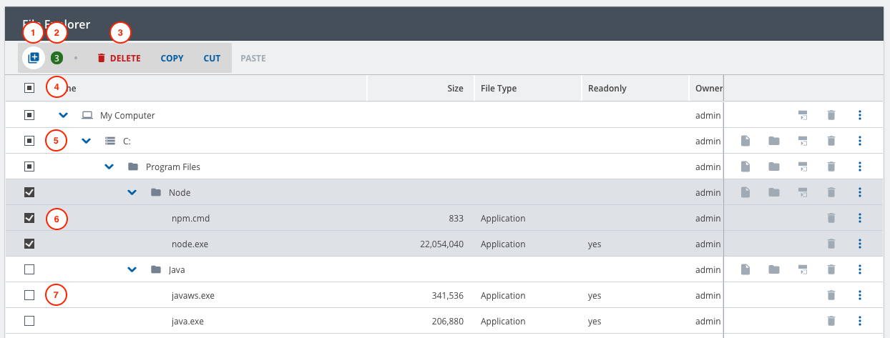

////
SPDX-License-Identifier: EUPL-1.2 OR LicenseRef-commercial
Copyright (c) 2012-2026 mgm technology partners GmbH
Dual License
This source file is part of the mgm A12 Platform and available under a choice of two different licenses:
1. Open-Source License - EUPL v1.2
You may redistribute and/or modify this file under the terms of the European Union Public License, version 1.2 - see https://eupl.eu/.
2. Commercial License
Alternatively, you may obtain a commercial license from mgm technology partners GmbH, that permits use of this software under different terms (including support and maintenance services).

Please contact a12-license@mgm-tp.com for more information.

You must select and comply with exactly one of the above license options.

Warranty Disclaimer (applies to either option)
THIS SOFTWARE IS PROVIDED "AS IS" AND WITHOUT WARRANTY OF ANY KIND, WHETHER EXPRESS OR IMPLIED, INCLUDING BUT NOT LIMITED TO THE WARRANTIES OF MERCHANTABILITY, FITNESS FOR A PARTICULAR PURPOSE AND NON-INFRINGEMENT, EXCEPT WHERE SUCH DISCLAIMERS ARE HELD TO BE LEGALLY INVALID. SEE THE RESPECTIVE LICENSE TEXT FOR DETAILS.
////
[#multi-selection]
=== Multi-Selection

Tree Engine provides a *multi-selection* feature that allows users to select multiple rows and perform actions on those selected rows.

The *multi-selection area* is a dedicated part of each row that users can click to toggle the row's selection state.
It is configurable through the model and supports the following options:

- *Rows and checkboxes* (default) — both row clicks and checkboxes can toggle selection.
- *Checkboxes only* — selection is managed exclusively via checkboxes.

Users can select rows in two ways:

- *Single selection*: Click on a row’s selection area to toggle its selection.
- *Range selection*: Hold Shift and click another row’s selection area to select a consecutive range of rows.

For model configuration, please see link:/docs/SME/sme-tm-ba-docs/index.html#multi-selection[SME documentation].

==== Components
[image,options="nowrap",title="Multi-selection feature"]

Some multi-selection components need to be explained:

* *Multi-selection panel*: the gray section including components [1], [2], and [3].
* *Multi-selection button* [1]: to enable/disable the feature, as well as expand/collapse the multi-selection panel.
* *Multi-selection counter* [2]: to indicate the number of selected nodes.
* *Multi-selection event buttons* [3]: to perform bulk operations. Their modelling configurations are similar to normal Tree event button.
* *Overall checkbox* [4]: to indicate the overall multi-selection state of the whole tree.
* *Node checkboxes*: to indicate the current multi-selection state of a node, including: _partly selected_ [5], _selected_ [6], or _deselected_ [7].

==== Performing the Bulk Operation

Firstly, the multi-selection button's event name should be configured in the Tree Model.
Then, the action could be listened to by watching link:./assets/generated/typedoc/variables/core_store.Events.onMultiSelectionEventButtonClicked.html[onMultiSelectionEventButtonClicked] event.
For example:

[source,typescript,options="nowrap",title="src/sagas/watch-nodes-deletion-saga.ts"]
--
function* watchNodesDeletionSaga(activityId: string): SagaGenerator<void> {
	yield* takeLatest((action: AnyAction) => {
		return (
			TreeEngineActions.event.match(action) &&
			Events.onMultiSelectionEventButtonClicked.match(action.payload.engineAction) &&
			action.payload.activityId === activityId &&
			action.payload.engineAction.payload.button.event === "event_delete_nodes"
		);
	}, handle);
}

function* handle(action: Action<TreeEngineActions.EventPayload<Action<Events.MultiSelectionEventButtonClickedPayload>>>) {
	...
}
--
