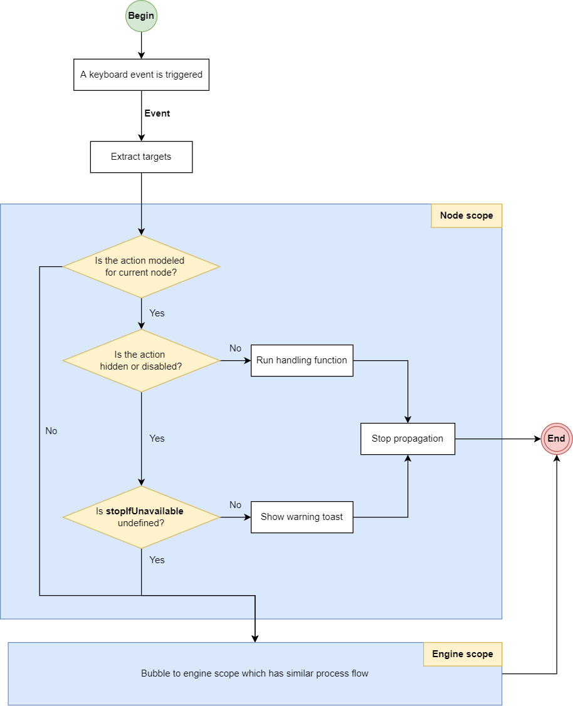

////
SPDX-License-Identifier: EUPL-1.2 OR LicenseRef-commercial
Copyright (c) 2012-2026 mgm technology partners GmbH
Dual License
This source file is part of the mgm A12 Platform and available under a choice of two different licenses:
1. Open-Source License - EUPL v1.2
You may redistribute and/or modify this file under the terms of the European Union Public License, version 1.2 - see https://eupl.eu/.
2. Commercial License
Alternatively, you may obtain a commercial license from mgm technology partners GmbH, that permits use of this software under different terms (including support and maintenance services).

Please contact a12-license@mgm-tp.com for more information.

You must select and comply with exactly one of the above license options.

Warranty Disclaimer (applies to either option)
THIS SOFTWARE IS PROVIDED "AS IS" AND WITHOUT WARRANTY OF ANY KIND, WHETHER EXPRESS OR IMPLIED, INCLUDING BUT NOT LIMITED TO THE WARRANTIES OF MERCHANTABILITY, FITNESS FOR A PARTICULAR PURPOSE AND NON-INFRINGEMENT, EXCEPT WHERE SUCH DISCLAIMERS ARE HELD TO BE LEGALLY INVALID. SEE THE RESPECTIVE LICENSE TEXT FOR DETAILS.
////
[#keyboard-shortcuts]
=== Keyboard Shortcuts

Tree Engine supports keyboard shortcuts for certain common actions (e.g. expand the whole tree, copy/paste nodes).

[source,typescript,options="nowrap",title="src/view.ts"]
--

import * as KeyCode from "keycode-js";

export const CustomViewComponent: React.FC<TreeEngineFactories.ViewComponentProps> = (props) => {
	const keyboardShortcuts: KeyboardShortcut[] = [
		{
			keyCombinations: [{ eventCode: KeyCode.CODE_E }],
			target: {
				type: KeyboardShortcut.TargetType.ENGINE_BUILTIN_ACTION,
				action: KeyboardShortcut.EngineBuiltinAction.EXPAND_WHOLE_TREE
			}
		},
		{
			keyCombinations: [{ modifierKeys: [KeyboardShortcut.ModifierKey.Ctrl], eventCode: KeyCode.CODE_C }],
			target: {
				type: KeyboardShortcut.TargetType.NODE_EVENT_ACTION,
				event: "event_copy_node"
			}
		}
	];

	return <TreeEngineFactories.ViewComponent {...props} keyboardShortcuts={keyboardShortcuts} />;
};

--

==== API

link:./assets/generated/typedoc/interfaces/core_view.KeyboardShortcut.html[KeyboardShortcut] interface has the following properties which are used to control what and how shortcuts are handled:

[source,typescript,options="nowrap",title="KeyboardShortcut interface"]
--
include::assets/generated/typescript/keyboard-shortcut.ts[]
--

==== Key Combination

link:./assets/generated/typedoc/interfaces/core_view.KeyboardShortcut.KeyCombination.html[`KeyboardShortcut.KeyCombination`] interface, which is a simple form of
https://developer.mozilla.org/en-US/docs/Web/API/KeyboardEvent[Web API KeyboardEvent],
contains two fields:

* `eventCode`: identical to KeyboardEvent's *code* property. It represents a physical key on the keyboard as *_string_*,
and is not affected by the modifier keys such as `Shift`, `Alt`,... The Engine will compare it to the listened event's *code* to
determine the equality. The https://www.npmjs.com/package/keycode-js[keycode-js] package can be used here for type safety.

NOTE: The *code* of number keys in a standard keyboard have different values, e.g. `Digit4` and `Numpad4`.
It is also true for operational keys in the number keyboard block and each pair of modifier keys (e.g. `ShiftLeft` versus `ShiftRight`)

* `modifierKeys` (optional): a list of unique modifier keys: `Shift`, `Ctrl`, `Alt` and `Meta`
(on Mac keyboards, the `Command ⌘` key; on Windows keyboards, the `Windows ⊞` key).
They will be compared to the corresponding properties: *shiftKey*, *ctrlKey*,... of
the listened KeyboardEvent.

[#keyboard-shortcuts/target]
==== Target

In general, a target action can be triggered by keyboard shortcuts if users can trigger it by mouse. So the following situations will not work:

* Register shortcuts for non-modeling buttons (in subheader/footer bar or nodes).
* Trigger shortcuts for hidden/disabled row actions (e.g. through <<#_customize_row_action_state_getter, RowActionState API>>).
* Trigger node multi-selection shortcut when the multi-selection mode is disabled.

There are six types of target which belongs to two scopes:

* *_Engine scope_*:
** *EngineBuiltinActionTarget*: built-in actions such as expand/collapse multi-selection panel or the whole tree,...
** *EngineEventActionTarget*: subheader, footer or multi-selection action buttons.
** *EngineInsertActionTarget*: the insert actions belong to the virtual root.

* *_Node scope_*:
** *NodeBuiltinActionTarget*: built-in actions such as toggle multi-selection state, expand or collapse,...
** *NodeEventActionTarget*: event node actions.
** *NodeInsertActionTarget*: insert node actions.

Two `BuiltinActionTarget` can be declared through the corresponding enums: `EngineBuiltinAction` or `NodeBuiltinAction`.
Similarly, `EventActionTarget` uses the `event` field of the action as its identifier. In case of `InsertActionTarget`,
the identifier is `documentModelRef` field.

Engine scope will run whenever a Tree element is focused. If that element is a row, the Node scope will be executed first.
The keyboard event will stop right there if any node action is triggered. Otherwise, (e.g., the action is hidden or disabled),
the event will be bubbled up to the Engine scope.

==== Handling Keyboard Shortcut Events

When a keyboard shortcut event is triggered from a row, the Node scope is considered to handle it before the Engine scope.

This event is used to extract targets (see <<#keyboard-shortcuts/target, Keyboard shortcut target>>) from the configured keyboard shortcuts.

These targets are subsequently used to check if the corresponding actions are modeled for current node.

* In case the modeled action for current node is not hidden or disabled. The handler is executed and event propagation stops.
* In case the modeled action for current node is hidden or disabled. Keyboard shortcuts with the same target are checked if `stopIfUnavailable` property is defined.
** If `stopIfUnavailable` is defined: A warning toast is shown to user and event propagation stops.
** If `stopIfUnavailable` is not defined: The event is bubbled to engine scope.
* In case there are not any modeled action for current node, the event is bubbled to Engine scope.

Engine scope would continue to handle the bubbled event, that node scope could not solve, using similar logical steps.

The process of handling keyboard shortcut events is summarized as the following figure.

[image,options="nowrap",title="Keyboard shortcuts handling flow"]

