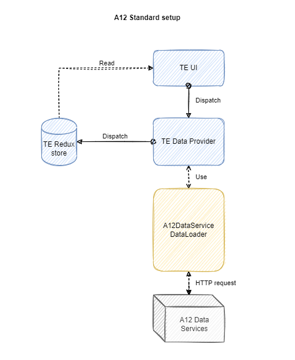

////
SPDX-License-Identifier: EUPL-1.2 OR LicenseRef-commercial
Copyright (c) 2012-2026 mgm technology partners GmbH
Dual License
This source file is part of the mgm A12 Platform and available under a choice of two different licenses:
1. Open-Source License - EUPL v1.2
You may redistribute and/or modify this file under the terms of the European Union Public License, version 1.2 - see https://eupl.eu/.
2. Commercial License
Alternatively, you may obtain a commercial license from mgm technology partners GmbH, that permits use of this software under different terms (including support and maintenance services).

Please contact a12-license@mgm-tp.com for more information.

You must select and comply with exactly one of the above license options.

Warranty Disclaimer (applies to either option)
THIS SOFTWARE IS PROVIDED "AS IS" AND WITHOUT WARRANTY OF ANY KIND, WHETHER EXPRESS OR IMPLIED, INCLUDING BUT NOT LIMITED TO THE WARRANTIES OF MERCHANTABILITY, FITNESS FOR A PARTICULAR PURPOSE AND NON-INFRINGEMENT, EXCEPT WHERE SUCH DISCLAIMERS ARE HELD TO BE LEGALLY INVALID. SEE THE RESPECTIVE LICENSE TEXT FOR DETAILS.
////
[#data-loader]
=== Tree Engine Data Loader

Tree Engine comes with a default A12 Server Connector that provides the data fetching/modifying logic based on the A12 standard setup. However, in some cases, where A12 standard setup does not provide sufficient features or extension points, developers would want to adapt either server-side or client-side code to fulfill their needs.

Generally, it would be simpler to adapt the server-side implementation. However, in case adaption cannot be done on the server-side, Tree Engine also offers a possibility to do it on the client-side.

[#data-loader/use-cases]
==== Use Cases

There are several use cases that customizing the default Tree Engine Data Loader can come in handy:

* Have a connection to the Data Services instance but some minor adjustments are needed. For example: Filter the root node(s), fetch from a different endpoint for a specific query...
* Have no connection to Data Services instance. For example: In SME (Simple Model Editor), most of the connections and data storage are done on the client-side.
* Have a connection to the backend server, but it is a completely different instance of Data Services.

[#data-loader/default-data-loader]
==== Default Data Loader

[image,options="nowrap",title="Tree Engine Data Loader flow"]

From the above figure, `A12DataServiceDataLoader` is responsible for sending/receiving the request/response from Data Services instance. When being triggered, the data loader will be given with a single or a list of transformed Tree Engine operation(s) which consist of:

* A list of queries.
* A list of mutations.

After transforming queries & mutations into HTTP request(s), a response is expected to be returned from the server.
`A12DataServiceDataLoader` will process the response into the compatible data structure for further manipulation in Tree Engine.

[#data-loader/query]
==== Query

Any data loading/fetching in Tree Engine always resolves into a list of queries.
A query can be in different types, below are some of the most important query types that Tree Engine supports:

* link:./assets/generated/typedoc/interfaces/extensions_server-connector.DataOperation.Query.ListRootNodes.Query.html[*ListRootNodes*]: Fetches the root nodes of the tree.
* link:./assets/generated/typedoc/interfaces/extensions_server-connector.DataOperation.Query.ListChildNodes.Query.html[*ListChildNodes*]: Fetches the child nodes of a specific parent node.
* link:./assets/generated/typedoc/interfaces/extensions_server-connector.DataOperation.Query.TreeNodes.Query.html[*TreeNodes*]: Fetches a list of nodes for multi-level loading strategy.

Other than that, a query also includes:

* ID.
* Relationship Model.
* Computed roles (parent, child).
* Target Document Model name.
* An *_optional parent source_*.
* An *_optional list of fields_* to be retrieved (<<#data-loader/fields-projection,field projection>>).

NOTE: More information can be found in link:./assets/generated/typedoc/types/extensions_server-connector.DataOperation.Query.html[DataOperation.Query API documentation].

Below are several examples of how a query is created by Tree Engine:

[source,typescript,options="nowrap",title="*_ListRootNodes_* without a parent source"]
--
include::assets/typescript/features/data-loader-examples.ts[tag="ListRootNodes"]
--

[source,typescript,options="nowrap",title="*_ListRootNodes_* with a parent source or *_ListChildNodes_*"]
--
include::assets/typescript/features/data-loader-examples.ts[tag="ListChildNodes"]
--

[source,typescript,options="nowrap",title="*_TreeNodes_*"]
--
include::assets/typescript/features/data-loader-examples.ts[tag="TreeNodes"]
--

[source,typescript,options="nowrap",title="*_SubTreeNodes_*"]
--
include::assets/typescript/features/data-loader-examples.ts[tag="SubTreeNodes"]
--

When a query is triggered by the Tree Engine, it is transformed into a link:/docs/DATA_SERVICES/dataservices-documentation-src/index.html#_query_api[Data Services Query API] request.
This transformation maps Tree Engine's `DataOperation.Query` types and properties to the structure expected by the Data Services.

[#data-loader/query-result]
===== Query Result
After the request is sent and a response is received from Data Services, the data loader maps the response back into Tree Engine's expected data structures. This includes:

* Matching the response ID to the original query.
* Extracting entries and links, and processing documents as needed.
* Handling paging and filtering to ensure only the relevant results are returned to the Tree Engine.

A query result is represented by the `DataOperation.QueryResult` type, which contains:

* ID: Matches the original query ID, allowing Tree Engine to identify the corresponding result.
* Entries: An list of relational entries of type `Relationship.LinkWithDocument`, each containing:
** `linkRef`: A descriptor for the relationship link.
** `document`: The node's document, including all required fields for that node.

NOTE: More information can be found in link:./assets/generated/typedoc/types/extensions_server-connector.DataOperation.QueryResult.html[DataOperation.QueryResult API documentation].

[#data-loader/fields-projection]
===== Fields Projection

Tree Engine supports field projection by default, Tree Engine only retrieves the fields that are needed based on the columns that are displayed in the tree view.
This is done by passing a list of fields to the query, which will be used to filter the fields that are returned from the Data Services.
This is particularly useful for performance optimization, as it reduces the amount of data transferred over the network and processed by the client.

The fields are specified in the query as an array of strings, where each string represents a field path. For example:

[source,typescript,options="nowrap",title="Fields Projection in Query"]
--
include::assets/typescript/features/data-loader-examples.ts[tag="ListChildNodesWithFieldsProjection"]
--

[#data-loader/mutation]
==== Mutation

Mutation represents for data modification that can be happened on the Tree Engine. A mutation could be:

* Add link operation
* Delete node operation
* Delete link operation
* Move node operation
* Copy node operation
* And more to come...

The data loader can be triggered with a list of mutations, which will happen when the user tries to perform a bulk operation via multi-selection.

Each mutation is filled with all needed information (e.g. Delete node mutation includes document ID & the link ID).
It also expects a result which can be either successful or failed.

Depending on the mutation type, the result can be different.

See link:./assets/generated/typedoc/types/extensions_client.TreeEngineOperation.Mutation.html[TreeEngineOperation.Mutation] for more detail.

[#data-loader/mutations-result]
===== Mutations Result

After the mutations are executed, the data loader will return a list of results for each mutation.
Each result contains:

* ID: Matches the original mutation ID, allowing Tree Engine to identify the corresponding result.
* Type: The type of the mutation (e.g., ADD_LINK, DELETE_NODE).
* Payload: The result of the mutation, it can be either a success or a failure.
  ** For successful mutations, it contains different information depending on the mutation type.
  ** For failed mutations, it contains an error message or code.

NOTE: More information can be found in
link:./assets/generated/typedoc/types/extensions_client.TreeEngineOperation.Done.html[TreeEngineOperation.Done]
and link:./assets/generated/typedoc/types/extensions_client.TreeEngineOperation.Failed.html[TreeEngineOperation.Failed] API documentation.

[#data-loader/combine]
==== Combine Queries and Mutations

In general, when being triggered, a data loader will be provided with both queries and mutations.
Most of the actions triggered by user always result in a list of queries which need to be loaded.

Every mutation also requires some queries to be reloaded because of outdated information needed to be updated after a mutation is resolved.

It is advised to execute all mutations before executing any queries otherwise the unexpected behavior might be popped up.

[#data-loader/document-processor]
==== Document Processor

The data loader provides a `DocumentProcessor` instance, this is a utility helper which facilitates the serialize/deserialize process of object returned from Data Services.
As the current state, it is mainly used to convert all the date/time fields of a document model from serialized string into a Date object and the other way around.
See link:./assets/generated/typedoc/interfaces/extensions_server-connector.DocumentProcessors.html[DocumentProcessor] interface for more detail.

[#data-loader/customize]
==== Customize Data Loader

Customizing/Implementing Tree Engine data loader is pretty simple and straightforward as long as the expected result and the order of executing mutations and queries are ensured.

[source,typescript,options="nowrap",title="src/appsetup.ts"]
--
include::assets/typescript/features/custom-data-loader.ts[tag="CustomDataLoader"]
--

NOTE: link:./assets/generated/typedoc/functions/extensions_client.maybeAsyncFnWrapper.html[maybeAsyncFnWrapper] is optional and only required to be used when https://www.npmjs.com/package/typed-redux-saga[typed-redux-saga] is installed.
Otherwise, a simple call effect would be enough.

WARNING: Other settings for the A12 Server Connector module might not be preserved and passed into the customized data loader.
In case other settings are set, please have a more in-depth look into every Tree Engine function that is called within the customized data loader to make sure that the additional parameters are not missed.

===== Custom fields projection

If the default fields projection does not meet your requirements, you can customize it by implementing your own `TreeEngineDataLoader`.

[source,typescript,options="nowrap",title="src/customDataLoaderFieldsProjection.ts"]
--
include::assets/typescript/features/custom-data-loader.ts[tag="CustomDataLoaderFieldsProjection"]
--
