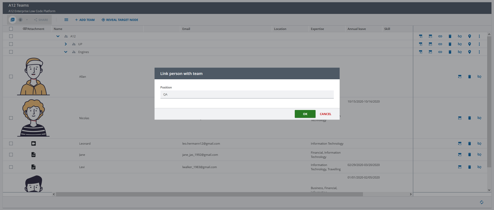

////
SPDX-License-Identifier: EUPL-1.2 OR LicenseRef-commercial
Copyright (c) 2012-2026 mgm technology partners GmbH
Dual License
This source file is part of the mgm A12 Platform and available under a choice of two different licenses:
1. Open-Source License - EUPL v1.2
You may redistribute and/or modify this file under the terms of the European Union Public License, version 1.2 - see https://eupl.eu/.
2. Commercial License
Alternatively, you may obtain a commercial license from mgm technology partners GmbH, that permits use of this software under different terms (including support and maintenance services).

Please contact a12-license@mgm-tp.com for more information.

You must select and comply with exactly one of the above license options.

Warranty Disclaimer (applies to either option)
THIS SOFTWARE IS PROVIDED "AS IS" AND WITHOUT WARRANTY OF ANY KIND, WHETHER EXPRESS OR IMPLIED, INCLUDING BUT NOT LIMITED TO THE WARRANTIES OF MERCHANTABILITY, FITNESS FOR A PARTICULAR PURPOSE AND NON-INFRINGEMENT, EXCEPT WHERE SUCH DISCLAIMERS ARE HELD TO BE LEGALLY INVALID. SEE THE RESPECTIVE LICENSE TEXT FOR DETAILS.
////
[#limitation-of-link-document-model]
=== Limitation of Link Document Model

When drag and drop a single node, if the relationship between this one and its targeted parent has a link:/docs/OVERALL/relationships_for_bas/index.html#relationships_link_doc[Link Document Model], a modal is shown to update additional information of the link as the following example from Tree Engine showcase.

[image,options="nowrap",title="Modal to update additional information when drag a person into a team"]

However, there is no appropriate UI/UX solution for updating Link Document of multiple links, for now. Therefore, if the Tree Model has a Link Document Model in any relationship, drag & drop for multi-selected nodes and copy/cut & paste functionalities are not provided intentionally.
