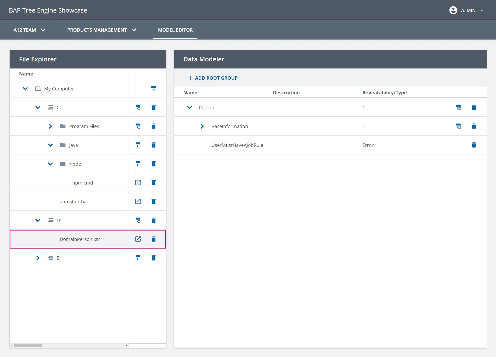

////
SPDX-License-Identifier: EUPL-1.2 OR LicenseRef-commercial
Copyright (c) 2012-2026 mgm technology partners GmbH
Dual License
This source file is part of the mgm A12 Platform and available under a choice of two different licenses:
1. Open-Source License - EUPL v1.2
You may redistribute and/or modify this file under the terms of the European Union Public License, version 1.2 - see https://eupl.eu/.
2. Commercial License
Alternatively, you may obtain a commercial license from mgm technology partners GmbH, that permits use of this software under different terms (including support and maintenance services).

Please contact a12-license@mgm-tp.com for more information.

You must select and comply with exactly one of the above license options.

Warranty Disclaimer (applies to either option)
THIS SOFTWARE IS PROVIDED "AS IS" AND WITHOUT WARRANTY OF ANY KIND, WHETHER EXPRESS OR IMPLIED, INCLUDING BUT NOT LIMITED TO THE WARRANTIES OF MERCHANTABILITY, FITNESS FOR A PARTICULAR PURPOSE AND NON-INFRINGEMENT, EXCEPT WHERE SUCH DISCLAIMERS ARE HELD TO BE LEGALLY INVALID. SEE THE RESPECTIVE LICENSE TEXT FOR DETAILS.
////
[#advanced/hidden-root-node]
=== Hidden Root Node

Tree Engine offers the possibility to customize the root node.
This feature can be useful for the case in which user wants to see/open the sub-tree of a document (from an Overview Engine or Tree Engine) in another engine.

For example: In Tree Engine Showcase, we have a file explorer example which can open a Document Model file.

[image,options="nowrap",title="Data modeller showcase"]

To get started with this feature, it is required to be:

- Familiar with Client's activity concept.
- Knowledgeable of writing custom Redux saga.

When Tree Engine is rendered, it will initially send a batch request for `LIST_TERMINATING_LINKS` operation based on your Tree Model configuration.
However, in the use case where the Document Model `DomainPerson.json` is opened, the `LIST_TERMINATING_LINKS` operation may return the root groups from the other Document Models.
These mixed groups of different documents can be very confused and not manageable.

To solve this case, Tree Engine provides an API to specify the starting root node by creating a Tree Engine activity with these descriptors:

* *rootInstance*: the id of your root document, e.g. "DomainFile/1"
* *rootRelationshipName*: the relationship link between the root instance and Tree Model's root node, e.g. `DocumentModelFileGroup`
* *rootRelationshipRole*: the role of the root instance in the Relationship Model, e.g. `File`

Below is a custom saga that catches the custom action from the left Tree Engine then create another Tree Engine activity with the custom descriptors:

[source,typescript,options="nowrap",title="src/model-editor/sagas/handle-open-document-model-button-saga.ts"]
--
include::assets/generated/typescript/showcase/model-editor/sagas/handle-open-document-model-button-saga.ts[tags="HiddenRootNode"]
--
